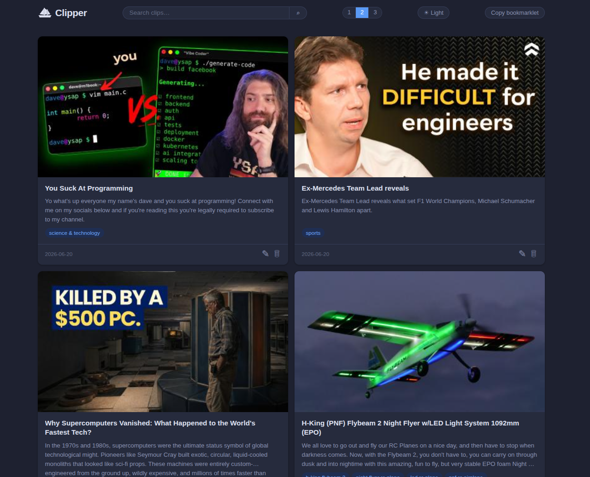

# Clipper

A browser bookmarklet and Spring Boot app for saving web page clips. Click the bookmarklet on any page and Clipper captures the title, URL, Open Graph metadata, tags, selected text, page body text, candidate images, and related links directly from the live DOM — no server-side scraping required. A two-step popup composer lets you review and curate the clip before submitting. When you save, Clipper downloads and caches the selected images locally so saved cards render from your own copy — independent of the original site.



---

## How it works

1. You click the **Clip it** bookmarklet on any page.
2. The bookmarklet opens a popup immediately (preserving the user-gesture token so popup blockers cannot interfere), then injects `clipper.js` from the Clipper server into the source page.
3. `clipper.js` collects metadata, tags, images, related links, and body text from the live DOM and POSTs them to `POST /clip`.
4. The server sanitises the payload, stores it in memory with a 1-hour TTL, and returns a `clipId` and a `composeUrl`.
5. `clipper.js` navigates the already-open popup to `GET /clip/{clipId}`.
6. The composer popup opens in two steps:
   - **Step 1 — Edit:** Review and edit the captured text, manage tags, reorder and select images, and manage related links.
   - **Step 2 — Preview:** See how the card will look, then submit.
7. On submit, the server caches each selected image locally, then saves the post to H2 (including page body text, indexed in Lucene for full-text search).
8. The saved post page (`GET /post/{id}`) renders entirely from cached local images — no dependency on the original site.

### CSP-restricted sites (YouTube, SharePoint, etc.)

Sites that block script injection via Content Security Policy (CSP) prevent `clipper.js` from loading. The bookmarklet handles this gracefully:

- The popup is opened **synchronously** inside the user-gesture handler, before any async work, so the popup cannot be blocked.
- The popup initially loads `GET /clip/quick` with URL, title, selected text, and any metadata already captured inline by the bookmarklet (Twitter card image, OG tags, keywords, canonical URL).
- If `clipper.js` loads successfully, it POSTs a richer payload and navigates the existing popup to the full composer — the window is reused by name (`bb_clip`) so no second popup appears.
- If the script is blocked by CSP, the popup stays on the minimal quick-clip page and the user can continue from there.

---

## Features

### Metadata capture

The bookmarklet collects the following fields from every page:

| Field | Source |
|---|---|
| `url` | `window.location.href` |
| `title` | `document.title` |
| `selectedText` | Active text selection at click time |
| `pageText` | Visible body text (nav/header/footer/scripts stripped, capped at 100 KB) |
| `description` | `<meta name="description">`, then `og:description` |
| `canonicalUrl` | `<link rel="canonical">` |
| `ogTitle` | `<meta property="og:title">` |
| `ogDescription` | `<meta property="og:description">` |
| `ogImage` | `<meta property="og:image">` |
| `relatedLinks` | `<link rel="related">`, `<a rel="related">`, JSON-LD `relatedLink` |

All text extraction runs client-side in the browser, so it works behind logins and paywalls without any extra server-side request.

### Full-text search

The home page has a search bar that queries all saved posts via a Lucene index. Searching uses an **English analyzer** (Porter stemming + stopword removal, so "running" matches "run") and prefix matching on each word. The index covers:

- Title (OG title if edited, original title otherwise)
- Selected / edited body text
- Meta description
- Tags
- Page body text (captured at clip time)

Search results are returned in relevance order. Clearing the query (or submitting an empty one) returns all posts sorted by last-updated date.

### Tag extraction and filtering

Tags are aggregated from multiple sources and deduplicated (lowercased, max 100 chars each, up to 50 total):

- `<meta name="keywords">`, `news_keywords`, `category`, `tags`
- `<meta property="article:section">` and repeating `article:tag`
- `<a rel~="tag">` links — covers WordPress, Baeldung, and most CMS-driven sites
- Breadcrumb navigation (`nav[aria-label*="breadcrumb"]`, `.breadcrumb a`, `#wayfinding-breadcrumbs_feature_div a`, and Schema.org microdata) — covers Amazon and most e-commerce / news sites that skip meta keywords
- Schema.org JSON-LD blocks: `keywords`, `articleSection`, `about[].name`, and `genre`

**Generic tag filtering** runs server-side on every save and edit. Tags are dropped if they:
- Are in Lucene's English stop word list (`the`, `a`, `in`, …), or
- Appear in `generic-tags.txt` (common web-UI phrases, vague metadata words, platform-generic terms like `upload`, `sharing`, `free streaming`), or
- Contain more than 5 words.

Kept and dropped tags are logged at INFO level.

### Image collection

Images are collected from multiple sources, in priority order:

1. `<meta name="twitter:image">` / `twitter:image:src` — most reliable thumbnail on video sites (YouTube, Twitter/X)
2. All `<meta property="og:image">` elements
3. JSON-LD `thumbnailUrl` arrays
4. All `` elements on the page

Images are filtered to remove icons and tracking pixels:

- At collection time: images where **both** known dimensions are below 300 px are dropped before the payload is sent.
- After rendering in the composer grid: the `onload` handler checks true natural dimensions and hides any image where both dimensions are below 300 px.
- Broken images (CORS errors, 404s) are hidden via `onerror`.
- Up to 20 images reach the server.

**Default selection:** when multiple images are present, the second image is pre-selected (the first is often a generic site logo on YouTube and Amazon).

### Related links

Related links are collected automatically from:
- `<link rel="related">` elements in `<head>` (title from the `title` attribute)
- `<a rel="related">` anchors in the page body (title from link text)
- JSON-LD `relatedLink` field (string or array)

Up to 10 links are collected automatically. In the composer and edit pages, additional links can be added by **dropping any URL** onto the Related Links section. When a URL is dropped, the server fetches its page title via `GET /api/fetch-title` and updates the label. Titles are displayed truncated to 30 characters. Related links are saved with the post and displayed on the post view page.

### Two-step composer

**Step 1** presents all captured data for review:
- Editable textarea for the selected text
- Tag chips with add/remove — pre-populated from the page's tag sources
- Image grid with drag-to-reorder and click-to-toggle-select; drop a URL onto the image section to add a new candidate
- Related links list with add-by-drop and per-link remove

**Step 2** shows the preview card:
- All selected images in a responsive grid
- Title, body text, and source link
- Back button to return and adjust; Submit button to save

### Image caching

When the user submits in Step 2, the server caches all selected images before saving the post. This decouples saved posts from the original site — images continue to display even if the source site moves, hotlink-blocks, or deletes them.

**Download safety:**
- Only `http` and `https` URLs are accepted; `file:`, `data:`, `javascript:`, and other schemes are rejected.
- Hostnames are resolved before connecting; private, loopback, link-local, and CGNAT addresses are blocked to prevent SSRF.
- Redirects are followed up to a configurable limit, with the same address checks applied at each hop.
- Downloads are capped at a configurable maximum size (default 10 MB).
- The `Content-Type` header must begin with `image/`; SVG is rejected.
- The downloaded bytes are decoded with `ImageIO` to confirm they are a valid image.

**Storage:**
- Files are written atomically: download to temp file, validate, then move into place.
- Filenames are derived from the SHA-256 of the downloaded bytes; the original filename is not used.
- Duplicate images (same bytes, different URLs) are deduplicated by checksum — only one file is stored.
- A thumbnail is generated alongside each original (default max dimension: 400 px).
- Image metadata is stored in H2.

**On failure:**
- If any selected image cannot be cached, the save is aborted and the composer displays a per-image error.

**File layout:**

```
~/.clipper/
  clipperdb.mv.db        # H2 database (posts + image metadata)
  search-index/          # Lucene full-text index
  images/
    originals/           # Full-size cached images (<sha256>.<ext>)
    thumbnails/          # Resized copies (<sha256>.<ext>)
```

### Home page

`GET /` shows a card grid of all saved posts, sorted by **last-updated date** (editing a post moves it to the top). Each card shows the primary image (thumbnail preferred), title, excerpt, and tags.

The column layout is user-selectable with **1 / 2 / 3** buttons in the topbar; the choice is persisted in `localStorage`. In 1-column mode cards are 20% wider than a 2-column card; in 3-column mode cards are narrower.

Clicking a card opens the post view; the ✎ icon opens the edit page; the 🗑 icon deletes after confirmation. A search bar filters cards via full-text search. **Clicking a tag** on any card or post page runs a search for that tag, showing all posts that share it.

The topbar also has a **Copy bookmarklet** button that copies a self-contained bookmarklet to the clipboard. The bookmarklet is generated dynamically from `window.location.origin` so it works on any host without manual configuration.

### Saved post view

`GET /post/{id}` renders the saved post using only cached local images. It shows:
- Page title with an ↗ link icon to the original page
- Selected cached images
- Selected / edited body text
- Related links (if any)
- Tags

### Editing

`GET /post/{id}/edit` opens an edit form. You can:
- Update the title, body text, and tags
- Toggle which cached images are shown; drag to reorder them
- Drop a URL onto the image section to fetch and cache a new image
- Add or remove related links (drop a URL to add; title is fetched automatically)
- Fetch fresh image candidates from the original source URL with **Fetch from source**

Edits save via JSON (`POST /post/{id}/edit`), update `updated_at`, and re-index the post in Lucene.

### Theme

All pages support dark and light themes with a toggle button in the header. The preference is persisted in `localStorage`.

---

## Stack

| Layer | Technology |
|---|---|
| Server | Spring Boot 3.3 · Java 17 |
| Templates | Thymeleaf |
| Bookmarklet | Vanilla JS (ES5, no dependencies) |
| Clip store | In-memory `ConcurrentHashMap` with 1-hour TTL |
| Post store | H2 (file-based) via Spring JDBC (`~/.clipper/clipperdb.mv.db`) |
| Full-text search | Apache Lucene with `EnglishAnalyzer` (Porter stemmer) |
| Image cache | Local filesystem (`~/.clipper/images/`) |
| Thumbnails | Thumbnailator |
| HTML parsing | Jsoup (source-image fetch + page-title fetch) |
| Tests | JUnit 5 + MockMvc + Mockito |

---

## Database

Clipper uses a file-based H2 database at `~/.clipper/clipperdb.mv.db`. The schema is created automatically on first run via `CREATE TABLE IF NOT EXISTS`; new columns are added with `ALTER TABLE … ADD COLUMN IF NOT EXISTS` so existing databases upgrade transparently.

### Tables

**`posts`** — one row per saved clip.

| Column | Type | Notes |
|---|---|---|
| `id` | VARCHAR PK | UUID |
| `clip_id` | VARCHAR | ID of the originating in-memory clip |
| `url` | VARCHAR | Source page URL |
| `title` | VARCHAR | Page title (`document.title`) |
| `og_title` | VARCHAR | OG title; cleared to `''` after a manual edit |
| `selected_text` | CLOB | User-selected or edited description |
| `description` | CLOB | `<meta name="description">` |
| `page_text` | CLOB | Visible body text captured by the bookmarklet (up to 100 KB) |
| `tags` | VARCHAR | JSON array of tag strings |
| `created_at` | VARCHAR | ISO-8601 instant |
| `updated_at` | VARCHAR | ISO-8601 instant; set on save, updated on every edit |
| `related_links` | VARCHAR | JSON array of `{url, title}` objects |

**`cached_images`** — one row per candidate image per post.

| Column | Type | Notes |
|---|---|---|
| `id` | VARCHAR PK | UUID |
| `post_id` | VARCHAR FK | References `posts.id` |
| `original_url` | VARCHAR | Source URL |
| `local_path` | VARCHAR | Relative path under `images/originals/` |
| `thumbnail_path` | VARCHAR | Relative path under `images/thumbnails/` |
| `sha256` | VARCHAR | Hex SHA-256 of file bytes (deduplication key) |
| `cache_status` | VARCHAR | `cached` · `failed` · `rejected` |
| `selected` | INTEGER | `1` = shown on the post, `0` = hidden |
| `rank_order` | INTEGER | Display order |
| … | | width, height, content_type, byte_size, alt_text, kind, cached_at, cache_error |

### Full-text search (Lucene)

A Lucene index lives alongside the database at `~/.clipper/search-index/`, with one document per post covering `title`, `og_title`, `selected_text`, `description`, `tags_text`, and `page_text`. Each field is analyzed with `EnglishAnalyzer` (Porter stemming + stopwords).

The index is rebuilt from the database on every startup, upserted on save/edit, and deleted on post deletion. Queries AND all words together (each word matched as raw prefix OR stemmed term across all fields) and return results in BM25 relevance order.

### Connection pool

H2 supports concurrent writers; HikariCP is configured with `maximum-pool-size=5`.

---

## Running

```bash
mvn spring-boot:run
```

The server starts on `http://localhost:8080`.

---

## Installing the bookmarklet

The easiest way is to open the Clipper home page and click **Copy bookmarklet**, then create a new browser bookmark and paste the copied code as the URL.

### Manual (development)

Create a browser bookmark with this URL:

```
javascript:(()=>{const s=document.createElement('script');s.src='http://localhost:8080/clipper.js';document.body.appendChild(s);})();
```

### Production

Replace `http://localhost:8080` with your deployed app's base URL, or use the **Copy bookmarklet** button on the home page — it generates the bookmarklet from `window.location.origin` automatically.

---

## Configuration

All settings are in `application.properties`.

```properties
# Directory for the H2 database, Lucene index, and image cache
clipper.data-dir=${user.home}/.clipper

# Image download limits
clipper.image.max-bytes=10485760          # 10 MB
clipper.image.connect-timeout-ms=10000   # 10 s
clipper.image.read-timeout-ms=30000      # 30 s
clipper.image.max-redirects=5

# Set true to allow downloading from localhost/private IPs (development only)
clipper.image.allow-private-addresses=false
```

---

## Running the tests

```bash
mvn test
```

Tests use JUnit 5, MockMvc, and Mockito and do not require a running server. Integration tests write to `/tmp/clipper-test`.

---

## API

### `POST /clip`

Accepts a JSON payload from `clipper.js` and returns a compose URL.

**Request body**

```json
{
  "url": "https://example.com/article",
  "title": "Article title",
  "selectedText": "Text the user highlighted",
  "pageText": "Full visible body text (up to 100 KB)",
  "description": "Meta description",
  "canonicalUrl": "https://example.com/article",
  "ogTitle": "OG title",
  "ogDescription": "OG description",
  "ogImage": "https://example.com/image.jpg",
  "images": [
    { "src": "https://example.com/image.jpg", "alt": "", "kind": "og_image", "width": null, "height": null }
  ],
  "keywords": ["java", "spring"],
  "relatedLinks": [
    { "url": "https://example.com/see-also", "title": "See also" }
  ]
}
```

**Response**

```json
{ "clipId": "550e8400-...", "composeUrl": "/clip/550e8400-..." }
```

### `GET /clip/quick`

CSP fallback endpoint. Accepts minimal data via query parameters (`url`, `title`, `text`, `ogTitle`, `desc`, `kw`, `cu`, `img` (repeatable)), creates an in-memory clip, and redirects to the compose page. Used when `clipper.js` cannot load due to CSP restrictions.

### `GET /clip/{id}`

Opens the composer page for the given clip ID. Returns 404 if the clip has expired (> 1 hour) or never existed.

### `POST /clip/{id}/save`

Caches the selected images and saves the post to H2. Returns 422 if any image fails to cache.

**Request body**

```json
{
  "selectedImages": [
    { "src": "https://example.com/image.jpg", "alt": "A photo", "kind": "og_image", "rankOrder": 0 }
  ],
  "selectedText": "Edited body text",
  "tags": ["java", "spring"],
  "relatedLinks": [
    { "url": "https://example.com/see-also", "title": "See also" }
  ]
}
```

**Response**

```json
{ "postId": "661f9511-...", "postUrl": "/post/661f9511-..." }
```

### `GET /`

Home page. Accepts an optional `?q=` parameter for full-text search. Results are sorted by `updated_at` descending (falls back to `created_at` for posts that have never been edited).

### `GET /post/{id}`

Renders the saved post page. All images are served from the local cache.

### `GET /post/{id}/edit`

Opens the edit form for the post.

### `POST /post/{id}/edit`

Saves edits to a post. Updates `updated_at`. Re-indexes in Lucene.

**Request body**

```json
{
  "title": "Updated title",
  "selectedText": "Updated body text",
  "tags": ["java"],
  "keepImageIds": ["img-uuid-1"],
  "newImages": [
    { "src": "https://example.com/new.jpg", "alt": "", "kind": "page_image", "rankOrder": 0 }
  ],
  "relatedLinks": [
    { "url": "https://example.com/see-also", "title": "See also" }
  ]
}
```

`keepImageIds` — IDs of existing cached images to keep selected; all others are deselected.  
`newImages` — source image URLs to download, cache, and add to the post.

**Response**

```json
{ "postUrl": "/post/661f9511-..." }
```

### `POST /post/{id}/delete`

Deletes a post, its cached image rows, and its Lucene document. Underlying image files are deleted unless their checksum is still referenced by another post.

**Response**

```json
{ "status": "deleted" }
```

### `GET /post/{id}/source-images`

Fetches and Jsoup-parses the post's original URL server-side, returning image candidates. Used by the edit page's **Fetch from source** button. Returns 502 if the source page is unreachable.

### `GET /api/fetch-title`

Fetches a URL server-side and returns its `<title>` (falling back to `og:title`). Used by the related-links drop zone to label dropped URLs.

**Query parameter:** `url` (required, must be http/https)

**Response**

```json
{ "title": "Example Domain" }
```

Returns `{"title": ""}` on fetch failure rather than an error status, so the client can fall back to displaying the URL.

### `GET /images/originals/{filename}`
### `GET /images/thumbnails/{filename}`

Serves cached image files. Responses include `Cache-Control: public, max-age=31536000, immutable`.

---

## Known limitations

- **Lazy-loaded content** — the bookmarklet collects what is present in the live DOM at click time. Content that loads later (infinite scroll, deferred images) may be missed.
- **Image hotlinking** — candidate images in the composer are loaded from their original remote URLs before save. Some CDNs block cross-origin loads; broken images are hidden automatically.
- **Clip TTL** — unsaved clips are stored in memory only and expire after 1 hour. Restarting the server also clears them.
- **No authentication** — any request with a valid ID can view a composer page or saved post. Do not use in a shared environment until auth is added.
